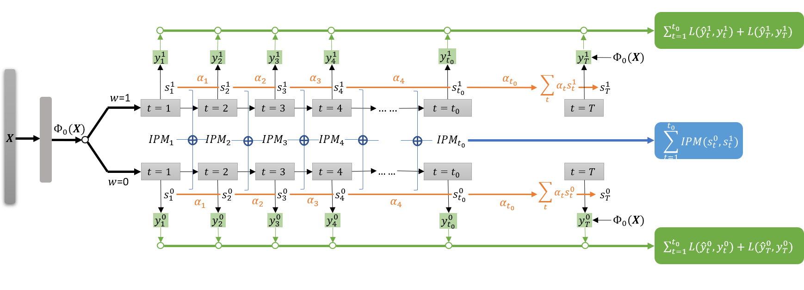

# LTEE
Implementation of paper Long-Term Effect Estimation with Surrogate Representation [1].

LTEE first transforms the context into a latent space and obtains the latent representation. It then builds double-headed RNNs where each head represents an RNN specifically trained for the treated or the control group. At each timestep, the RNN outputs the surrogate representation to perform two subtasks simultaneously: (1) predicting the outcome observed at t and (2) enforcing the similarity between distributions of surrogate representations in the treated and the control groups. At long-term T, we can observe the outcome in the source data (but not target data), and $s_T^w$ is the sum of all previous surrogate representations weighted by the attention mechanism. Consequently, the objective function of LTEE consists of the sum of the outcome prediction errors within each treatment assignment and imbalance errors (IPM) across treatment assignments at each timestep.

## Code usage
1. Run the data simulation script [data_generate.py](data_generate.py) for NEWS data and [data_generateIHDP.py](data_generateIHDP.py) for IHDP data.
2. Run the main program [LTEE_IHDP.py](LTEE_IHDP.py) for the experiments in Sec. 4.2 in the paper and [LTEE_IHDP_future.py](LTEE_IHDP_future.py) for the experiments in Sec. 4.3.
The output is the Mean Absolute Error averaged over 10 runs.

### Python packages version
* python == 2.7
* tensorflow == 1.1.0

### Reference
> \[1\] [Lu Cheng](http://www.public.asu.edu/~lcheng35/), [Ruocheng Guo](https://www.public.asu.edu/~rguo12/), and [Huan Liu](http://www.public.asu.edu/~huanliu/). Long-Term Effect Estimation with Surrogate Representation. *ACM International Conference on Web Search and Data Mining (WSDM)*, 2021. \[[paper](https://arxiv.org/pdf/2008.08236.pdf)\]
